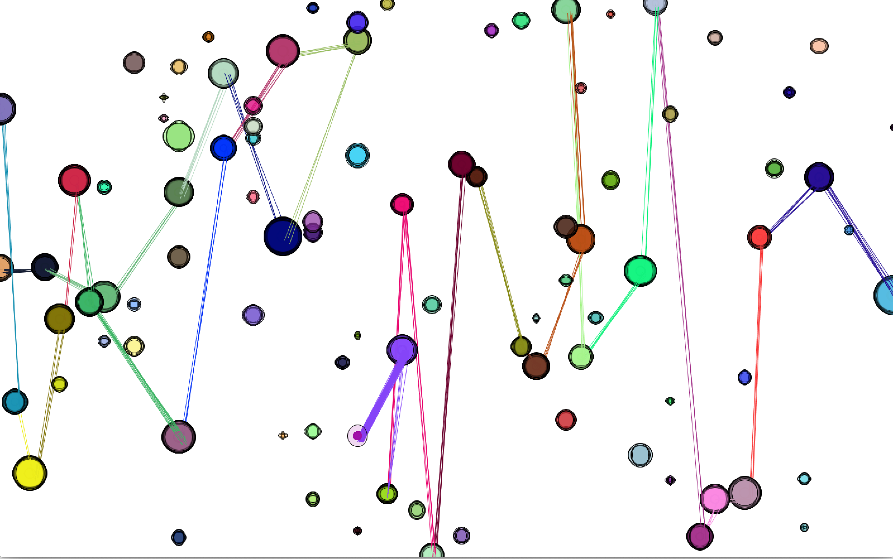
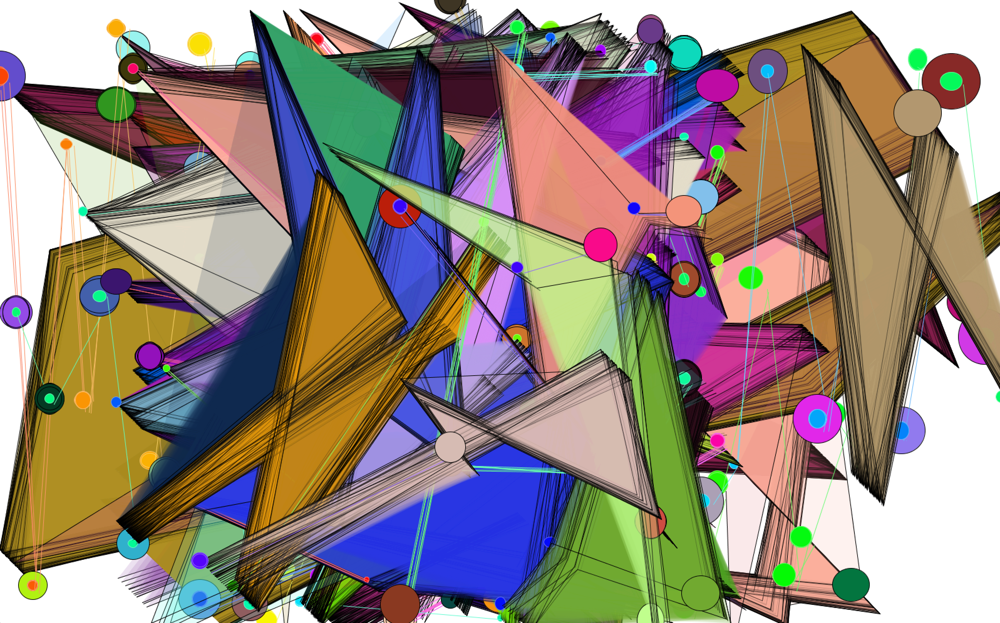
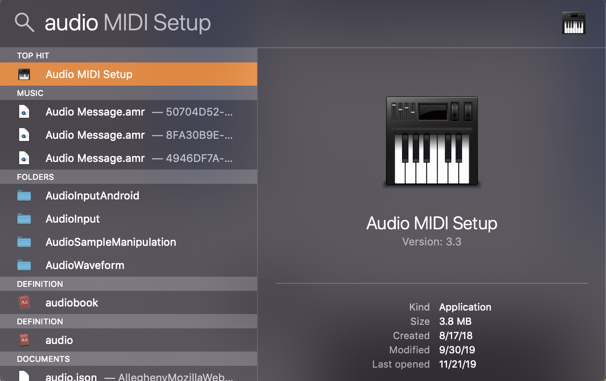
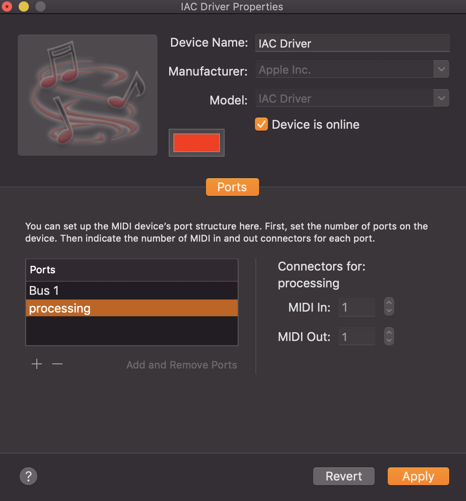

# Synesthesia

Synesthesia leverages `themidibus`, a processing library that allows users to use midi input in their code.
Using that midi, Synesthesia produces vibrantly colorful images representing midi inputs from midi files or live midi.

## Requirements

* Ableton
* Processing

### Installing Processing
In order to use the app, one needs to have processing installed. To get processing, you can visit their [page](https://www.processing.org/download/).

## How to set up
In order to set up the program, you will need to open up Ableton and start a new
project. If you're using a mac, you will need to created a connection from
processing to ableton.

Start by opening Audio MIDI Setup

On the top bar, click window and chose `show MIDI studio`
When you have that, double click on IAC Driver and check the box that says
"Device is online". In the ports section, click on the plus button and
change the name to whatever you'd like. You can now close out of the window
and open Ableton.

In your midi track, there should be a MIDI to menu bar. If you click that,
you should see the name of the port that you just created. That is how you
link Ableton and processing.

## Running program

To run the program, open Processing and Ableton. Make sure that there is
a connection for the MIDI. Load a midi file to Ableton and click the run
button in the Processing interface. Hit play on Ableton and shapes/colors
should begin appearing in the window that processing opened.
